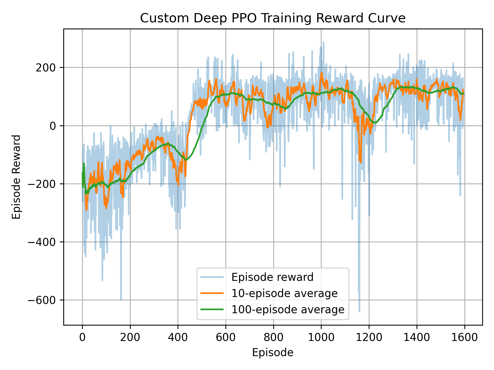
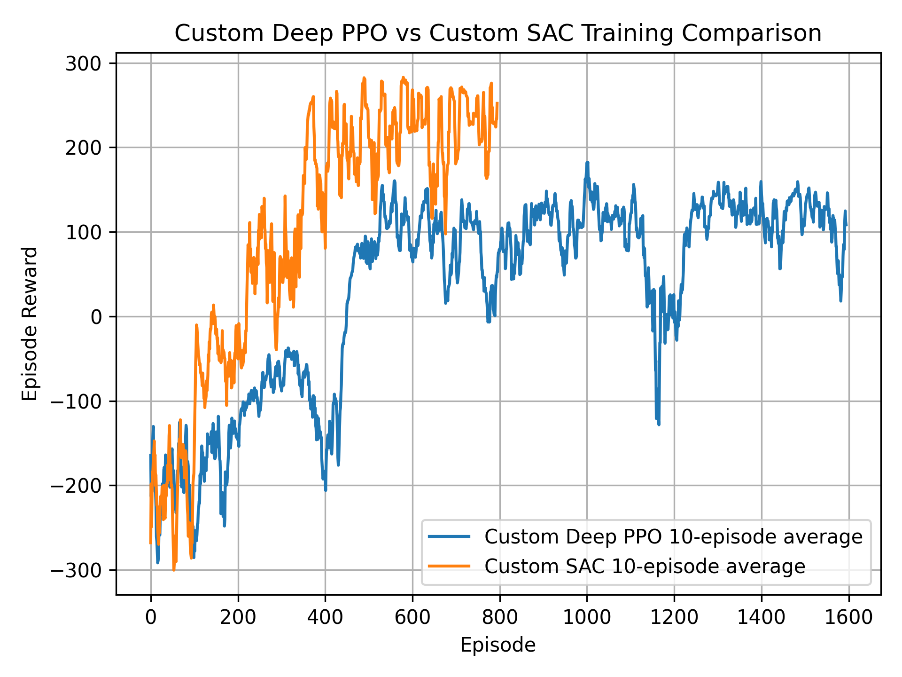

#### Academic Coursework

# RL LunarLander: Custom Deep PPO vs SAC

This repository contains a deep reinforcement learning project for continuous lunar landing control. The main agent is a **custom Deep PPO implementation**, while **custom SAC** is included as a comparison model.

- **Environment:** LunarLanderContinuous-v3
- **Objective:** learn continuous engine control for safe landing
- **Main Algorithm:** Custom Deep PPO
- **Comparison Algorithm:** Custom SAC
- **Frameworks:** PyTorch and Gymnasium

<p align="center">
  
</p>

<p align="center">
  <em>Trained reinforcement learning agent stabilizing descent and landing on the target pad.</em>
</p>

## Setup

```bash
git clone https://github.com/ememchijioke/rl-lunarlander-sac-ppo.git
cd rl-lunarlander-sac-ppo

python3 -m venv venv
source venv/bin/activate

pip install -r requirements.txt
```

## Train

```bash
# Train custom Deep PPO
python train_custom_ppo.py

# Train custom SAC
python train_custom_sac.py
```

## Evaluate

```bash
# Evaluate custom Deep PPO
python evaluate.py --algo custom_ppo --episodes 10

# Evaluate custom SAC
python evaluate.py --algo sac --episodes 10
```

## Record Videos

```bash
# Record custom Deep PPO videos
python record_video.py --algo custom_ppo --episodes 5 --video-folder videos/custom_ppo_1m

# Record custom SAC videos
python record_video.py --algo sac --episodes 5 --video-folder videos/sac_1m
```

Videos are saved under `videos/`.

## Plot Results

```bash
python plot_results.py
python compare_results.py
```

Plots are saved under `plots/`.

## Results

Both agents were trained for **1,000,000 timesteps**.

| Algorithm | Role | Mean Reward | Best Reward | Worst Reward |
|---|---|---:|---:|---:|
| Custom Deep PPO | Main model | 220.07 | 284.26 | 36.26 |
| Custom SAC | Comparison model | 233.57 | 282.58 | 16.45 |

Custom Deep PPO successfully learned the landing task and is the main coursework model. SAC achieved a slightly higher mean reward and is used as an additional comparison.

## Custom Deep PPO Training Curve

<p align="center">
  
</p>

## Custom SAC Training Curve

<p align="center">
  
</p>

## Custom Deep PPO vs Custom SAC Comparison

<p align="center">
  
</p>

## Evaluation Summary

<p align="center">
  
</p>

## Notes
- The main model is the custom Deep PPO implementation.
- PPO includes rollout collection, policy sampling, GAE advantage calculation, clipped PPO loss, value loss, entropy bonus, and gradient clipping.
- SAC is included as an additional comparison model.
- Video recording uses `rgb_array` rendering because live rendering caused instability on the local Linux system.

## License

MIT License