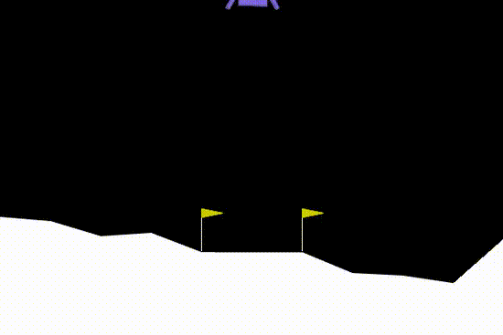
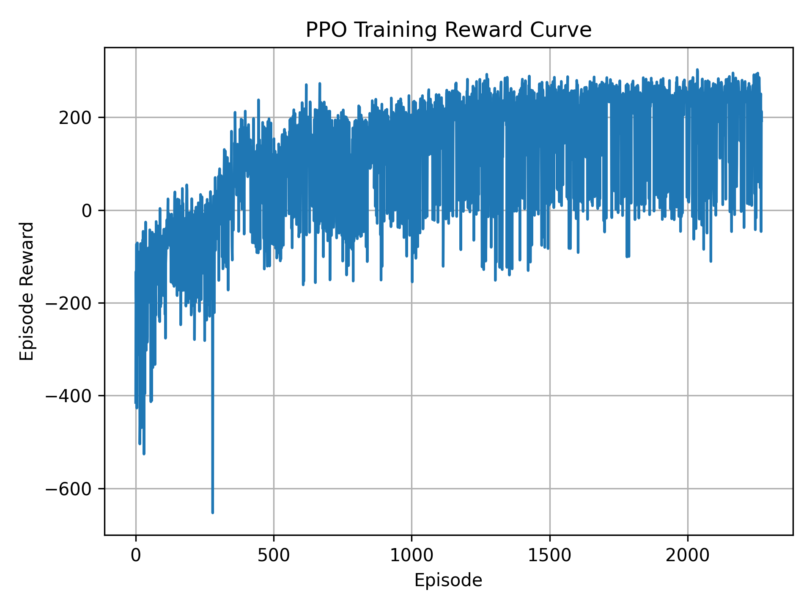
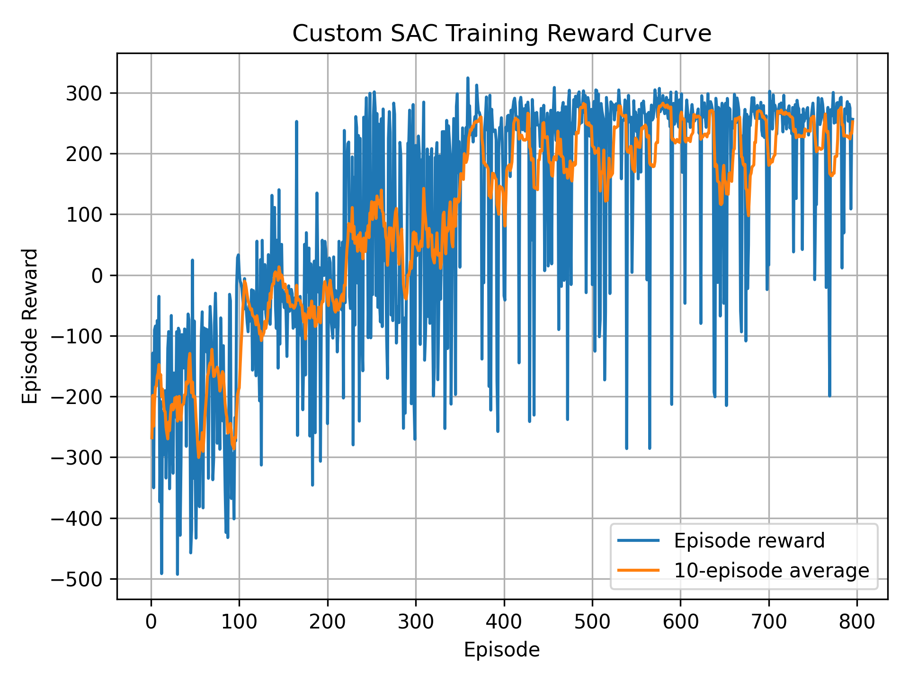
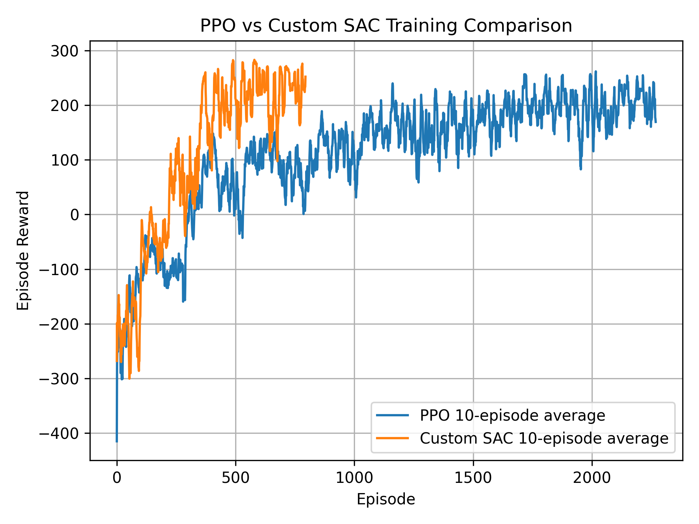
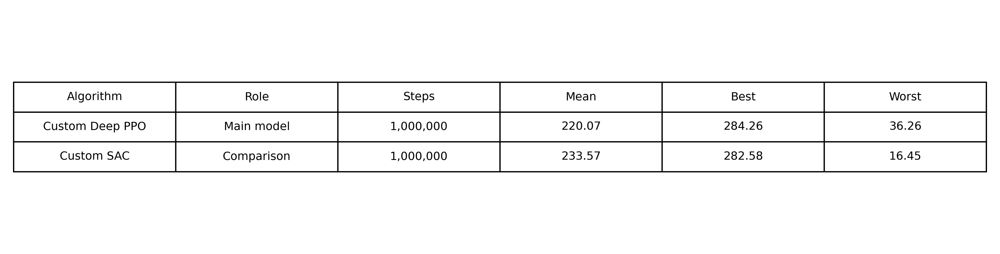

#### Academic Coursework

# RL LunarLander SAC PPO

This repository contains a project that applies deep reinforcement learning to control a lunar lander. It uses a custom Soft Actor-Critic (SAC) agent and a PPO baseline to help the lander stabilize its descent and land safely in the LunarLanderContinuous environment.


- **Environment:** LunarLanderContinuous-v3
- **Objective:** learn continuous engine control for safe landing
- **Algorithms:** Custom SAC and PPO baseline
- **Hardware:** trained locally with CUDA support, CPU fallback was available

<p align="center">
  
</p>

## Setup

```bash
git clone https://github.com/ememchijioke/rl-lunarlander-sac-ppo.git
cd rl-lunarlander-sac-ppo
python3 -m venv venv
source venv/bin/activate
pip install -r requirements.txt
````

## Train
```bash
# Train PPO baseline
python train_ppo_baseline.py
# Train custom SAC
python train_custom_sac.py
```

## Record videos
```bash
# Record PPO
python record_video.py --algo ppo --episodes 5 --video-folder videos/ppo_1m
# Record custom SAC
python record_video.py --algo sac --episodes 5 --video-folder videos/sac_1m
```
The videos are written under `videos/`.

## Plot training curves
```bash
python plot_results.py
python compare_results.py
```

## Results
## Results

Both agents were trained for **1,000,000 timesteps**.

| Algorithm | Mean Reward | Best Reward | Worst Reward |
|---|---:|---:|---:|
| PPO | 195.38 | 266.63 | 25.41 |
| Custom SAC | 233.57 | 282.58 | 16.45 |

## PPO Training Curve

<p align="center">
  
</p>

## Custom SAC Training Curve

<p align="center">
  
</p>

## PPO vs Custom SAC Comparison

<p align="center">
  
</p>

## Evaluation Summary

<p align="center">
  
</p>

## Notes

* Custom SAC implementation is inside `sac/`.
* PPO baseline uses Stable-Baselines3.
* Video recording uses `rgb_array` rendering because live rendering caused instability on the local Linux system.
* The comparison is based on training reward curves, final evaluation reward, and recorded landing behavior.

## License

MIT License
